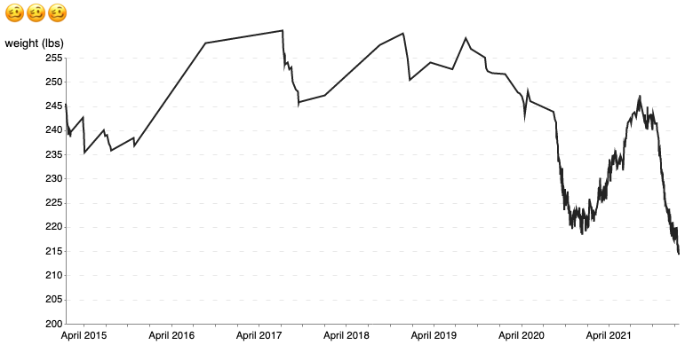
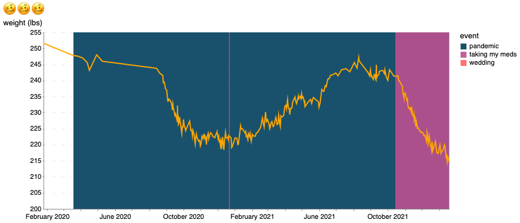

# exploring-healthkit-data
Exploring some of my own healthkit data (from apple watch)

## Using github codespaces and the web editor
A secondary goal of this small project is to familiarize myself with the github web editor (github.dev) and codespaces. 
What can be done with each and what cannot. [link](https://docs.github.com/en/codespaces/the-githubdev-web-based-editor)

I will try to only use these two tools for the project. I created the repo using the github website and I will make small edits using the web editor. I have not (yet) found the need to use codespaces but I expect to soon.

## log
2020-01-21: created v0.1 charts
- now that the codespace is set up it's easier to jump in and do stuff. created 2 basic charts: _weight data_ and _pandemic weight_
  

    
    
  

- used this palette generator: https://learnui.design/tools/data-color-picker.html 

2020-01-20: created repo
- added `weight.csv` (i first exported my healthkit data following the instructions of `healthkit-to-sqlite` and got a CSV off datasette)
